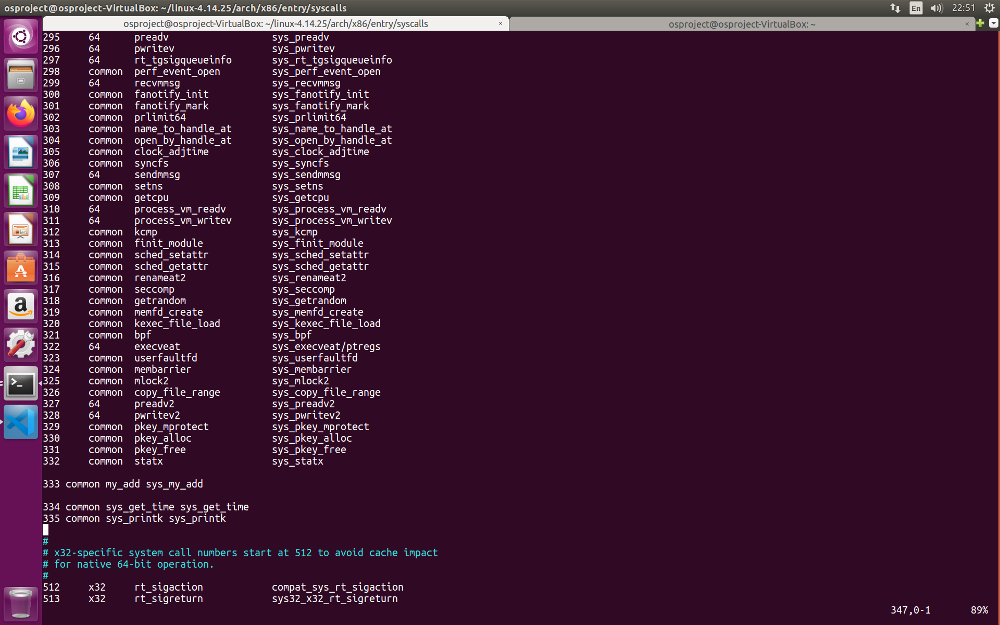

# 2020 OS Project 1 - Process Scheduling


## Design
# FIFO (or First-Come, First-Served)
* 原理
    * 最早到達的(即arrival time最小)process，修先取得CPU。
* 執行
    * 父程序將所有process按照ready time由小到大排序。
    * 若此時沒有子程序在執行，則父程序選擇一個ready time最小的process執行。
    * 若此時有子程序在執行，父程序將後進來的process先block住。

# SJF (Short Job First)
* 原理
    * 具有最小excution time的process，優先取得CPU。
* 執行
    * 父程序將所有process照ready time由小到大排序，若ready time相同，再按照execution time由小到大排序。
    * 若此時沒有子程序在執行，則父程序選擇一個ready time最小的process執行，若相同，則選擇execution time最小的先執行。
    * 若此時有子程序在執行，父程序將後進來的process先block住。

# PSJF (Preemptive Shortest Job First)
* 原理
    * 與SJF相似，但可以插隊，例如，若新到達的process的execution time比現在正在執行的process來的小，新的process可以插隊執行。
* 執行
    * 父程序將所有process照ready time由小到大排序，若ready time相同，再按照execution time由小到大排序。
    * 若此時沒有子程序在執行，則父程序選擇一個ready time最小的process執行，若相同，則選擇execution time最小的先執行。
    * 若此時有子程序在執行，如果進來的process's execution time比現在正在執行的process來的小，則將現在執行的process block住，改為執行新進來的process。

# RR (Round-Robin)
* 原理
    * OS會規定一個CPU time slice，當process取得CPU後，若未能在此slice內完成工作，則Timer會發出"Time-out" interrupt通知OS，OS則強制此process放掉CPU資源，給其他process使用，而此process需等下一輪才能拿到CPU，此外，每一輪中的processs是以FIFO順序取的CPU資源。
* 執行
    * 將所有process按照ready time由小到大排序。
    * 若此時沒有子程序在執行，父程序以FIFO順序決定執行順序。
    * 若此時有子程序在執行，且在time slice下還沒完成工作，父程序將其強制結束，並將ret值加1(表示下一個process)，使下一個process能夠執行。


## Kernel Version
* linux_4.14.25

* sys_get_time.c --> 獲得開始與結束時間
```c
#include <linux/linkage.h>
#include <linux/kernel.h>
#include <linux/timer.h>

asmlinkage int sys_get_time(unsigned long *now_sec, unsigned long *now_nsec){
    struct timespec t;
    getnstimeofday(&t);
    *now_sec = t.tv_sec;
    *now_nsec = t.tv_nsec;
    return 0;
}
```

* sys_printk.c --> 在dmesg上印出時間
```c
#include <linux/linkage.h>
#include <linux/kernel.h>

asmlinkage void sys_pj1_print(int pid, long start_time, long end_time) {
    static const long BASE = 1000000000;
    printk(KERN_INFO "[Project1] %d %ld.%09ld %ld.%09ld", pid, start_time / BASE, start_time % BASE, end_time / BASE, end_time % BASE);
}
```

* 


## Conclusion and Explanation
* 在實際打程式的時候發現，要讓程序銜接的最好，核心理念是要對於process作優先分級處理。正在執行process的為最優先，下一個要執行process為次要優先，其餘的processes順序最低。